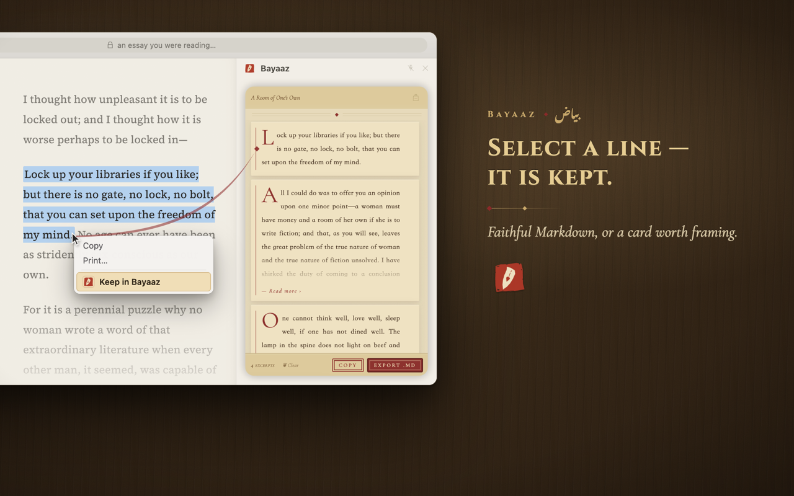
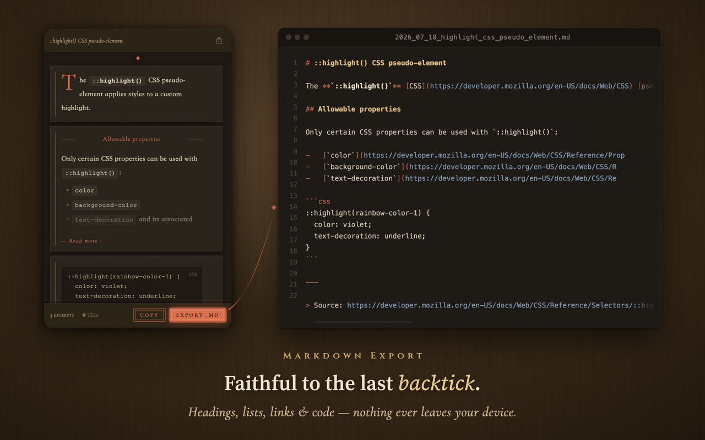
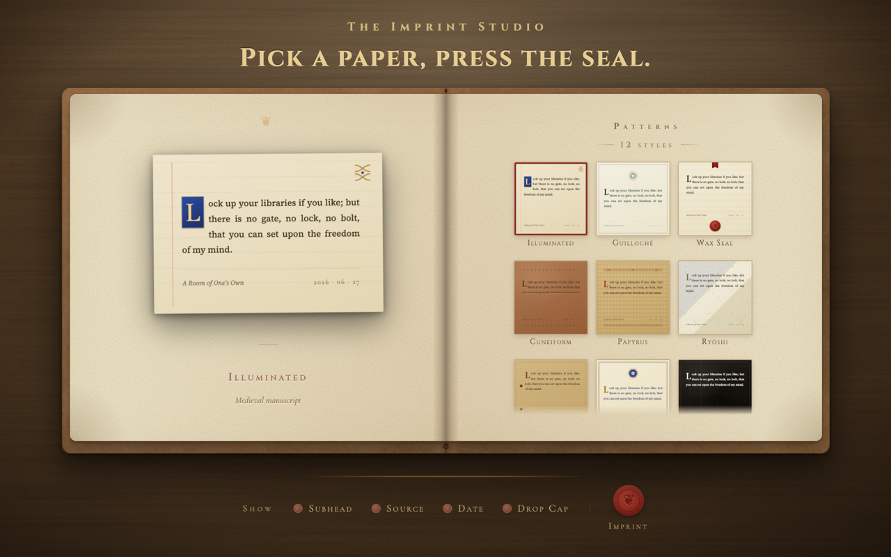
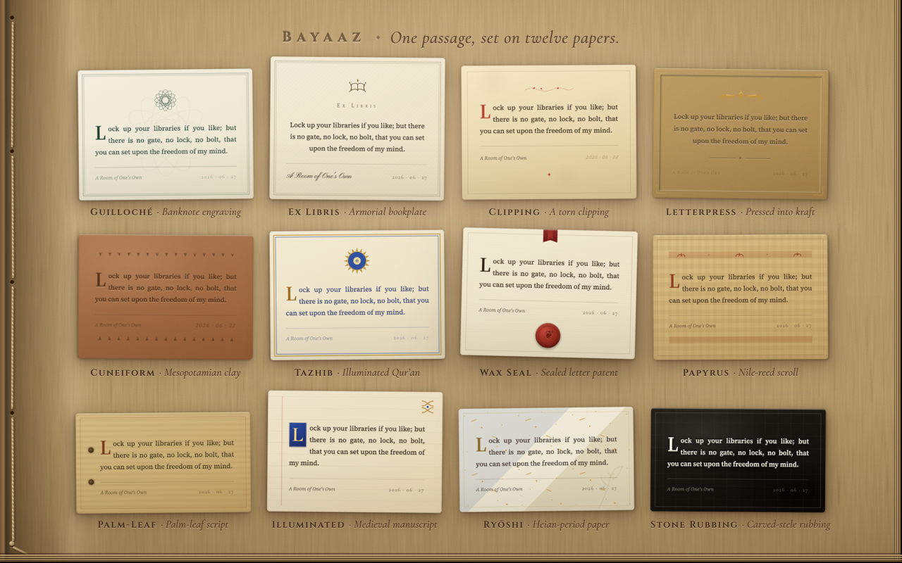
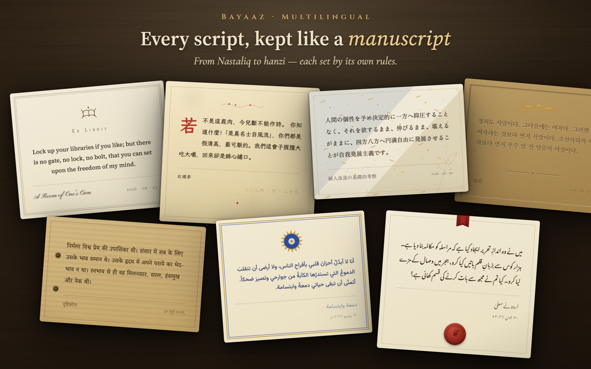

<h1 align="center">Bayaaz · بیاض</h1>

<b>English</b> · <a href="./README.zh.md">简体中文</a>

<i>A small library, kept by hand.</i>

Highlight a passage, keep it — faithful Markdown, or a keepsake card on twelve historic papers. Multilingual, 100% offline.

  

  <a href="https://chromewebstore.google.com/detail/bayaaz-markdown-web-clipp/beillbnfablabpoponiihpiefhgkphnd"><b>Install from the Chrome Web Store</b></a>

  <a href="#two-ways-to-keep">Markdown &amp; cards</a> ·
  <a href="#the-twelve-papers">The twelve papers</a> ·
  <a href="#each-script-set-the-way-it-writes-itself">Typography</a> ·
  <a href="#nothing-leaves-your-device">Privacy</a> ·
  <a href="#install">Install</a> 
  <a href="docs/design-notes.md">Design notes</a> ·
  <a href="docs/engineering-notes.md">Engineering notes</a> ·
  <a href="docs/specimens.md">The specimen book</a>

---

## The name

Bayaaz takes its root from Arabic, b-y-ḍ: white, blank, a page waiting to be written. In the Persian and Urdu literary tradition it grew into something particular: a private anthology — what English once called a commonplace book.

A bayāz is the trace of one reader's life: gathered over the years, every page is evidence of the moment a passage struck its keeper. What was chosen, what was left out, and in what order: the choices themselves are a portrait of a mind.

Across the Safavid and Mughal centuries, poets and princes of the Persian-speaking world kept one of their own; today, that notebook lives in your browser.

## Start in one minute

1. **Open.** Click the Bayaaz icon in the toolbar and the side panel stays beside the page; or select a passage first, right-click, and choose **Keep in Bayaaz**.
2. **Highlight.** With the panel open, every passage you select lands there by itself; title and text stay editable.
3. **Take it with you.** Copy it, or gather the collection into one `.md` file; when a line deserves more, send it to the Imprint Studio: pick a paper, press the seal, export a PNG.

## Two ways to keep

Each passage arrives exactly as written: headings, lists, links and code, faithful to the last backtick. It stays editable, and it remembers the page it came from. The side panel is a worktable: excerpts live in it, so export before closing.

**Markdown, for order.** One click gathers your excerpts into a clean `.md` file: dated, properly named, each source linked. It opens in Obsidian, Notion or your own writing system as if it had been written there.

  

**Cards, for treasures.** When one line deserves more, the Imprint Studio sets it on a paper with a lineage. Pick a paper, press the seal; print the card, paste it into a journal, tuck it into a book: a keepsake of the moment a sentence found you.

  

<b>How clipping works</b>

 

- A selection is cloned whole, in the page's real structure, then converted to Markdown: headings, lists and code keep their levels.
- One copy writes plain text, HTML and Markdown to the clipboard at once; whatever app you paste into takes the version it understands.
- Open shadow DOM is flattened before capture; relative links are resolved to absolute ones, so leaving the page does not break them.

The full pipeline, pit by pit: [engineering notes](docs/engineering-notes.md).

## The twelve papers

Each of the twelve is studied from a real tradition of keeping words, and each keeps its name in the language of its source, untranslated.

| Paper | Lineage |
|---|---|
| **Illuminated** | Gold and parchment of the medieval scriptorium |
| **Guilloché** | Lathe-engraved lines of banknotes and diplomas |
| **Wax Seal** | Letters patent under a red wax seal |
| **Cuneiform** | Words pressed into Mesopotamian clay |
| **Papyrus** | Reed sheets of the Nile |
| **Ryōshi** | Gold-flecked poem papers of Heian Japan |
| **Palm-Leaf** | Palm-leaf manuscripts of South Asia |
| **Tazhib** | Gold-and-lapis frontispieces of Persian and Ottoman manuscripts; the bayāz comes from the same manuscript world |
| **Stone Rubbing** | White characters lifted from an inked stele |
| **Ex Libris** | The engraved armorial bookplate |
| **Letterpress** | Metal type pressed into soft paper |
| **Clipping** | A corner torn from the newspaper, and kept |

  

The provenance is filed, paper by paper, in [The Twelve Papers](docs/papers.md). 
## Each script, set the way it writes itself

Multilingual here means how your clipped content is set; the interface is English.

- **The script is recognised first**: a passage is sorted by its letters as a whole, with Latin judged last; after that each script follows its own rules.
- **Chinese** follows the W3C's Chinese layout requirements: justified text, punctuation kept off line-starts, a drop cap two lines deep. Fake italics stay out: Chinese never had them.
- **Japanese and Korean** keep their own line-breaking and spacing, down to the small gap between kana and Latin.
- **Hindi**'s Devanagari takes no letter-spacing, which would break the syllables and their conjuncts; the line-height opens up for the vowel signs stacked above and below.
- **Arabic, Persian** and other connected scripts stay connected: letter-spacing never touches them, and numerals keep their own direction.
- **Urdu** is set in true Nastaliq from title to body: most of the web shows Urdu in Naskh, and clipping such a passage returns it to its own hand.
- **Latin** is set ragged-left without hyphenation, its dates in old-style figures; each of the twelve papers carries its own Latin face.
- **Vietnamese** is set as Latin, swapping out only the script faces that lack its diacritics; the bookplate's Latin label steps aside too.
- **Dates** follow each script's own form, Persian switching even the calendar to the solar year: on a card, the date reads as a signature.

  

Most fonts ship inside the extension, open-licensed and subsetted; each one's origin is in [Bundled Fonts — Attribution & License](fonts/README.md). Chinese body text deliberately keeps the system Song face; scripts without a bundled font fall back to system fonts.

Where the setting departs from the specs on purpose, the reasons are listed in the [Multilingual Typography Registry](docs/typography.md); real-card specimens of seven scripts are collected in [*The Multilingual Specimen Book*](docs/specimens.md).

## Nothing leaves your device

There is no account and no analytics; clipping, rendering and export all happen locally, and the fonts are in the package. Unplug the network and everything works the same.

The source is open and there is no build step: what you read is exactly what runs in the browser. The two third-party libraries, Turndown and html-to-image, are kept locally in the repository.

<b>Every permission, and why</b>

 

| Permission | Why |
|---|---|
| `contextMenus` | The right-click **Keep in Bayaaz** entry. |
| `sidePanel` | The panel where your excerpts collect. |
| `storage` | Theme, one-time onboarding flags, and the hand-off data of the last card sent to the Imprint Studio, all in `chrome.storage.local`, local only. Excerpts themselves never enter storage; they live in the side panel alone. |
| `downloads` | Saving `.md` files and card images to your disk. |
| `tabs` | Finding the article you're reading, collecting across tabs in the same window, and returning you to the page after a card is made, so each excerpt remembers its source. |
| `scripting` | Re-injecting the clipper after the extension updates, so open tabs keep working without a refresh. |
| Host access (`http/https`) | The clipper must run inside the page to read your selection. It reads the text you select, plus the page title and URL, so the excerpt remembers its source. |
| Remote code | **None.** Every script and font ships in the package. |

Full policy: [Privacy Policy](https://visual-story-ai.notion.site/Bayaaz-Privacy-Policy-39e3031c65a180a39023e0e402ccdad9).

## Install

- **[Chrome Web Store](https://chromewebstore.google.com/detail/bayaaz-markdown-web-clipp/beillbnfablabpoponiihpiefhgkphnd)**: Chrome 116+.
- **Manual**: download the zip from [Releases](../../releases) → open `chrome://extensions` → enable *Developer mode* → *Load unpacked*

<b>Known boundaries</b>

 

- It works on ordinary http/https pages: Chrome's internal pages, the Web Store, the built-in PDF reader and local file:// pages are off-limits to extensions by the browser itself.
- Clipping is text-first, and page images do not enter the exported Markdown; open shadow DOM gets dedicated handling, closed or cross-origin roots may be skipped.
- Right-to-left support changes the text direction and the colophon's side; the papers' ornaments stay in their left-to-right places.
- If a page clips wrong, open an [issue](../../issues) with the page URL, the passage you selected, and the steps to reproduce; for private pages, describing the structure is enough.

## The making of it, written down

Design notes · **[*Writing an Old Book in Code*](docs/design-notes.md)**: how to make skeuomorphs in code, how subsetting carries many scripts, how to set text that runs right to left, how to choose a typeface.

Engineering notes · **[*What a Passage Goes Through Before It Becomes a Card*](docs/engineering-notes.md)**: from selection to image, the pits along the way and their fixes.

**[*The Multilingual Specimen Book*](docs/specimens.md)**: Chinese, Japanese, Korean, Devanagari, Arabic, Urdu and Latin, one real card each, exported as-is, with its text, translation, source and choice of paper.

Three reference documents:

- [Multilingual Typography Registry](docs/typography.md): the rules of each script, from right-to-left direction to three calendars, each item naming the spec it follows, where it departs, and why.
- [The Twelve Papers](docs/papers.md): behind each stands a tradition that really existed; the original object and marking colour of each.
- [Bundled Fonts — Attribution & License](fonts/README.md): the origin, subset and licence of every bundled face.

## Colophon

At university, our Pakistani teacher, a grandfatherly man, gave us our names. He asked what my Chinese name meant. One character in it means to spread like grass, so I said *spread*. He named me Bahar بہار. I love it; it means spring.

Bayaaz بیاض and Bahar بہار begin with the same letter, ب. A notebook, and the one who writes in it.

One person made this, for everyone who still copies passages by hand. The words belong to the people who wrote them; Bayaaz simply helps you keep them close.

— Bahar

---

*Code is released under [GPL-3.0](LICENSE).*
