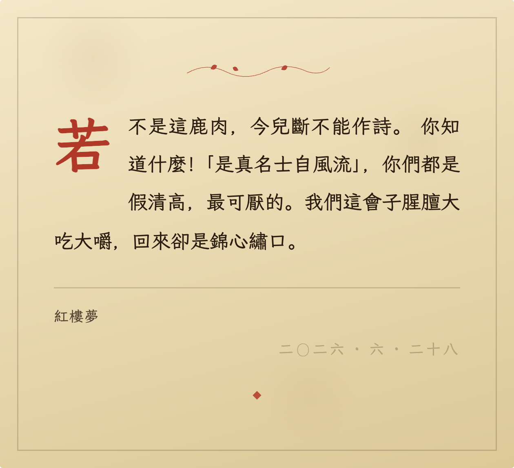
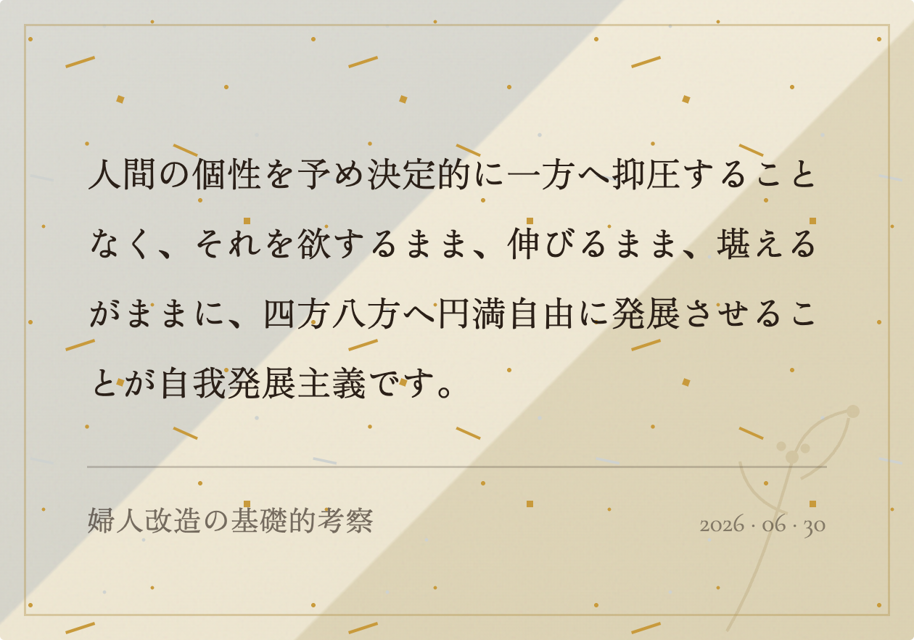
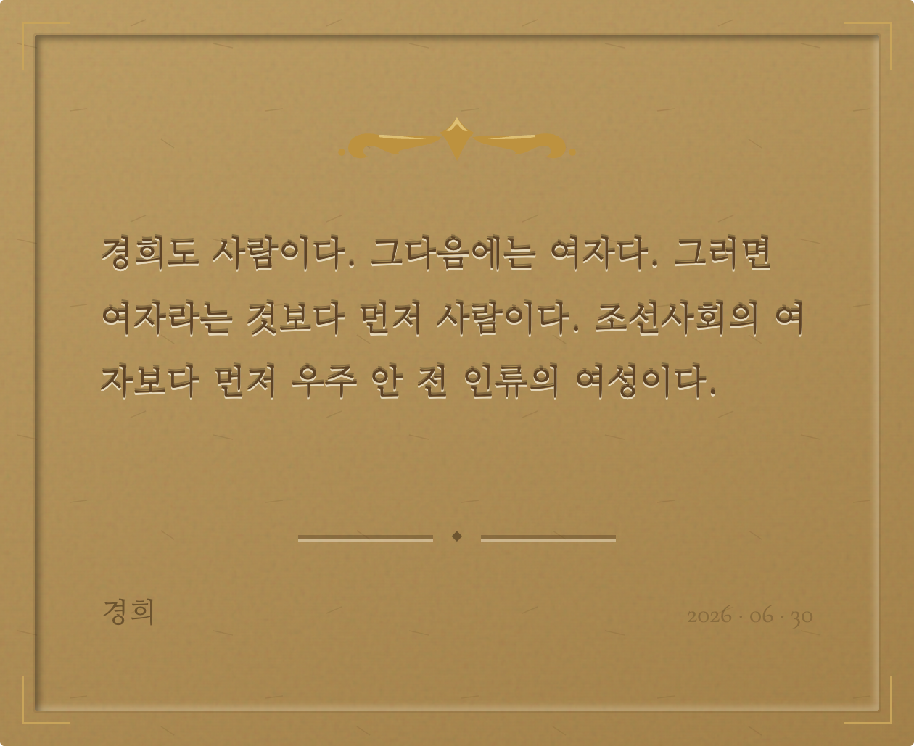
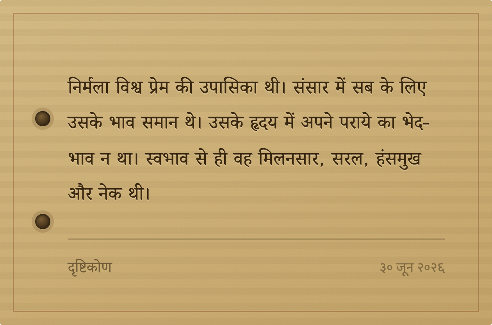
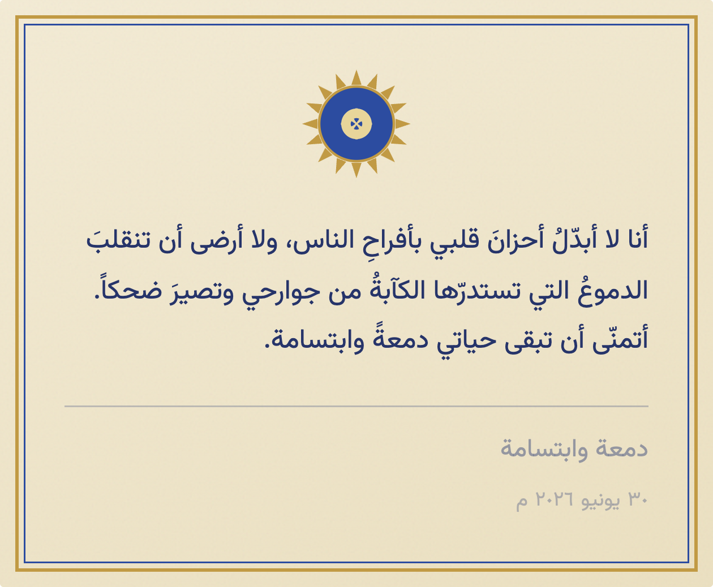
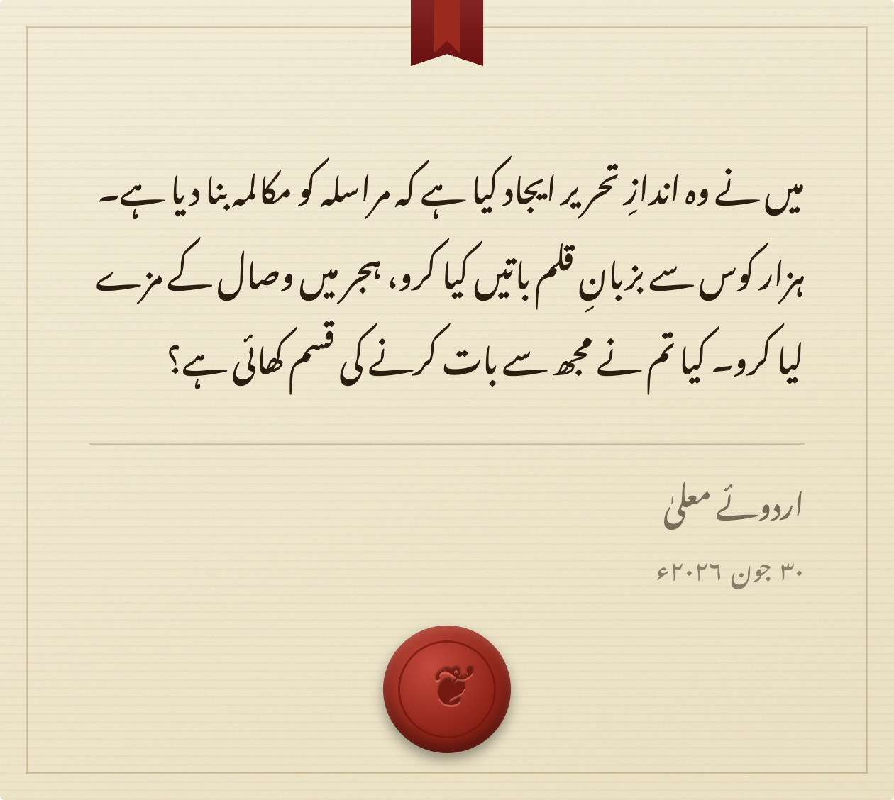
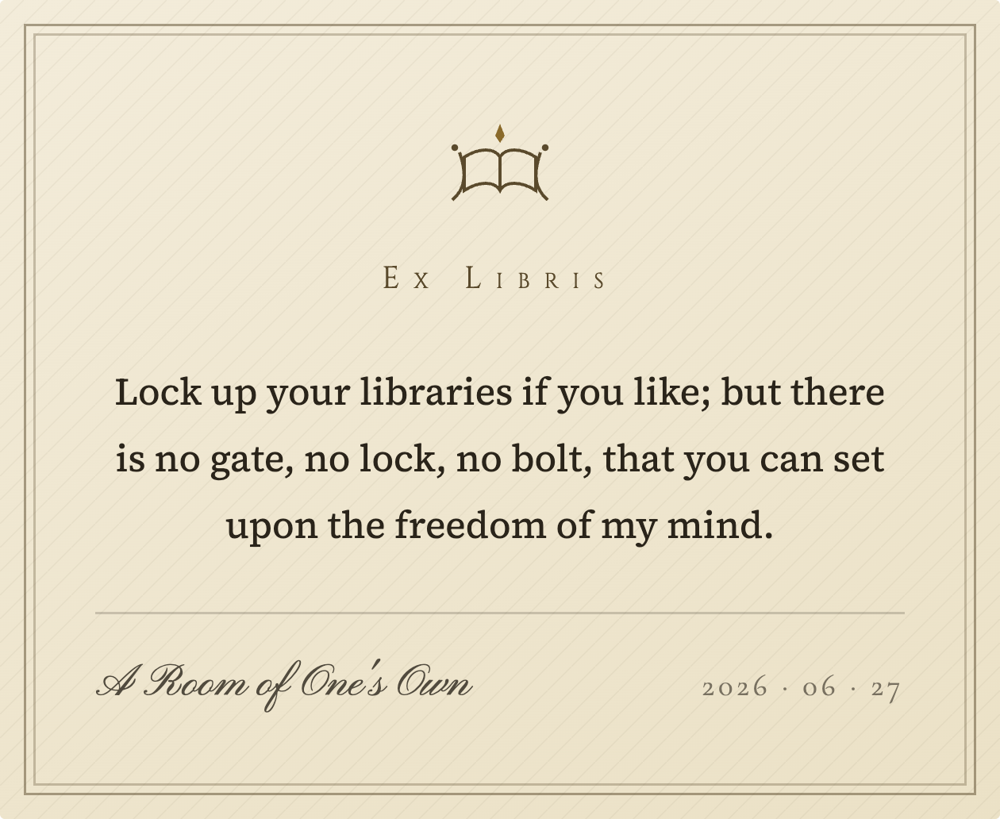

# The Multilingual Specimen Book

> The full table of typographic values lives in the [Multilingual Typography Registry](typography.md); the narrative lives in [*Writing an Old Book in Code*](design-notes.md). 中文版：[specimens.zh.md](specimens.zh.md)。

Seven scripts, one real card each, exported as-is. Each of these seven passages was written by someone who, in their own script, once took a step ahead.

Two lines were never crossed: every passage stands in the public domain (seventy years after the author's death as the global safe line, so authors dead by 1955), and every text was checked word for word against an authoritative edition, continuous, never spliced. The rest of the standard came out of redrafting: prose, three or four lines, a passage that lands, none that puts people at the centre; beauty alone was not enough.

## Chinese (traditional) · Clipping

**The text**: 若不是這鹿肉，今兒斷不能作詩。你知道什麼！「是真名士自風流」，你們都是假清高，最可厭的。我們這會子腥膻大吃大嚼，回來卻是錦心繡口。

**The translation**: If not for this venison, there would be no poems today. What do you know! "The true gentleman-scholar follows his own nature." It is you who play at being refined, and nothing is more tiresome. We gorge and reek of the roast this moment, and will come back with brocade hearts and embroidered mouths.

**The source**: *Dream of the Red Chamber*, chapter 49, Cao Xueqin. Venison roasted in the snow; teased for it, this is Shi Xiangyun firing back.

**Typography**: a vermilion drop cap exactly two lines tall, its wrap aligned to the character grid; justification spread between characters, no punctuation opening a line; line-height 1.95; source and date in one kai hand, a single signature, 「二〇二六 · 六 · 二十八」; a ◆ tailpiece.

**The paper**: a clipped passage, set on a torn clipping.

## Japanese · Ryōshi

**The text**: 人間の個性を予め決定的に一方へ抑圧することなく、それを欲するまま、伸びるまま、堪えるがままに、四方八方へ円満自由に発展させることが自我発展主義です。

**The translation**: The principle of self-development is to let a person's individuality unfold fully and freely in every direction, as it desires, as it grows, as it endures, without pressing it toward any one side in advance.

**The source**: *Fujin kaizō no kisoteki kōsatsu* (a foundational essay on the remaking of women), Yosano Akiko. Poet and pioneer of women's liberation.

**Typography**: Mincho body, line-height opened to 2.0; full-width punctuation in the grid, a half-width breath after each stop.

**The paper**: ryōshi is the native surface of Japanese writing.

## Korean · Letterpress

**The text**: 경희도 사람이다. 그다음에는 여자다. 그러면 여자라는 것보다 먼저 사람이다. 조선사회의 여자보다 먼저 우주 안 전 인류의 여성이다.

**The translation**: Kyŏnghŭi too is a human being. After that, a woman. So before being a woman, she is a person; before being a woman of Chosŏn society, she is a woman of all humankind in the wide universe.

**The source**: *Kyŏnghŭi* (1918), Na Hye-sok. The first Korean woman Western-style painter; the founding work of modern Korean feminist fiction.

**Typography**: Myeongjo serif, proportional punctuation with spaces; the letters pressed into the paper.

**The paper**: the birthplace of metal movable type, on letterpress: the Jikji, 1377, before Gutenberg.

## Devanagari · Palm-Leaf

**The text**: निर्मला विश्व प्रेम की उपासिका थी। संसार में सब के लिए उसके भाव समान थे। उसके हृदय में अपने पराये का भेद-भाव न था। स्वभाव से ही वह मिलनसार, सरल, हंसमुख और नेक थी।

**The translation**: Nirmala was a devotee of love for all the world. Toward everyone in it her feeling was the same; her heart made no division between her own people and strangers. By nature she was friendly, simple, cheerful and good.

**The source**: *Drishtikon*, Subhadra Kumari Chauhan. A writer twice imprisoned in India's independence movement; from her first story collection *Bikhare Moti* (Scattered Pearls, 1932).

**Typography**: the headline stroke unbroken; line-height 1.9, clearing the vowel signs stacked above and below; the date in Devanagari digits, ३० जून २०२६.

**The paper**: palm-leaf manuscripts are Devanagari's native surface.

## Arabic · Tazhib

**The text**: أنا لا أبدّلُ أحزانَ قلبي بأفراحِ الناس، ولا أرضى أن تنقلبَ الدموعُ التي تستدرّها الكآبةُ من جوارحي وتصيرَ ضحكاً. أتمنّى أن تبقى حياتي دمعةً وابتسامة.

**The translation**: I would not trade the griefs of my heart for the joys of the crowd, nor let the tears that sorrow draws from my depths be turned into laughter. I wish my life to stay a tear and a smile.

**The source**: the title passage of *A Tear and a Smile*, Kahlil Gibran. A founder of modern Arabic prose poetry; the book takes its title from this passage's last words.

**Typography**: Naskh body, right-to-left; the date ٣٠ يونيو ٢٠٢٦ م, Arabic digits with the era mark م, still running left to right inside a right-to-left line.

**The paper**: illuminated frontispieces and Naskh share one paper tradition.

## Urdu · Wax Seal

**The text**: میں نے وہ اندازِ تحریر ایجاد کیا ہے کہ مراسلہ کو مکالمہ بنا دیا ہے۔ ہزار کوس سے بزبانِ قلم باتیں کیا کرو، ہجر میں وصال کے مزے لیا کرو۔ کیا تم نے مجھ سے بات کرنے کی قسم کھائی ہے؟

**The translation**: I have invented a manner of writing that turns a letter into a conversation. From a thousand kos away, speak with the tongue of the pen; in separation, taste the pleasures of reunion. Or have you sworn an oath not to speak to me?

**The source**: a letter from *Urdu-e-Mualla*, Mirza Ghalib. He broke Urdu prose out of its old pile of ornament into living, spoken letters, and so founded modern Urdu prose; this passage is his most-quoted line on the letter.

**Typography**: title, body and signature all in Nastaliq; right-to-left, line-height 2.5, the largest on the page; the date ۳۰ جون ۲۰۲۶ء, extended digits with the era mark ء.

**The paper**: Ghalib's letter about letters, on wax-sealed stationery.

## Latin · Ex Libris

**The text**: Lock up your libraries if you like; but there is no gate, no lock, no bolt, that you can set upon the freedom of my mind.

**The source**: *A Room of One's Own*, Virginia Woolf. Early in the book she is turned away at a library door; this line is the retort that comes later, for every woman so turned away.

**Typography**: a bookplate set centred, no drop cap; the source in copperplate script, the date in old-style figures, 2026 · 06 · 27.

**The paper**: lock up your libraries; a bookplate of one's own, a library of one's own.
